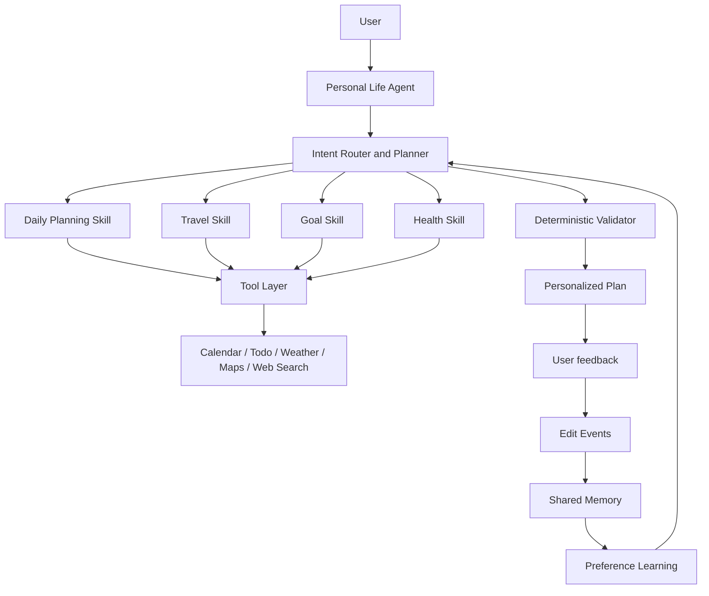
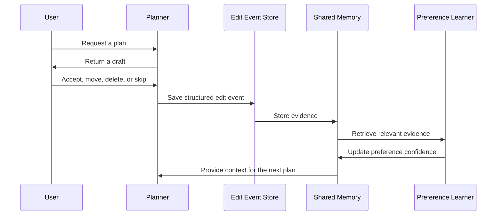

# Personal Life Agent

> **Project codename: Genshin-Agent**

[English](README.md) | [中文](README.zh-CN.md)

An evolving personal AI companion that learns how a user lives and turns that understanding into better plans over time.

> **Memory → Preference Learning → Personalized Planning**

## Project Status

The project is currently focused on the Daily Planner MVP: a planner, a controlled tool layer, deterministic schedule validation, memory models, and foundational tests. The immediate goal is to complete the learning loop so that user edits influence later plans.

Travel, goal, health, and other capabilities are planned as **Skills**. They are not separate user-facing agents.

## Vision

Most assistants start from zero on every request. A genuine personal assistant should build continuity: it remembers relevant context, notices how a user changes plans, and becomes more useful through repeated interaction.

Personal Life Agent gives the user one consistent assistant. Daily planning, travel, goals, health, and future domains are modular Skills that can safely use a shared understanding of the user.

## Core Concept

```text
User request → Plan → User feedback and edits → Shared Memory
      ↑                                             ↓
      └────── Preference Learning ←─────────────────┘
```

The system learns from structured evidence such as accepting, moving, deleting, skipping, or editing planned items. It does not treat a single edit as a permanent rule; it aggregates repeated patterns with context, recency, and confidence.

## Architecture



The planner orchestrates work; Skills solve a focused domain problem; tools provide controlled access to external data and actions; the validator enforces hard constraints; and shared memory preserves useful context across Skills.

## Features

### Current MVP

- Natural-language daily planning
- Calendar, todo, weather, and preference tool abstractions
- Structured plan output
- Deterministic conflict and rule validation
- Profile and behavioral memory models
- Edit-event-oriented feedback capture
- Foundational planner, validator, and memory tests

### Planned Skills

- **Travel:** personalized itineraries informed by maps, weather, research, and preferences
- **Goal:** long-term goal decomposition and goal-driven planning
- **Health:** routine and wellbeing planning within user-defined boundaries
- **More Skills:** study, finance, shopping, and other life-management domains

## Memory System

| Memory type | Purpose | Example |
| --- | --- | --- |
| Profile Memory | Explicit, durable settings and facts | Time zone, working hours, dietary restrictions |
| Episodic Memory | Important past events and outcomes | A recent trip or missed deadline |
| Behavioral Preference Memory | Aggregated evidence from repeated actions | Often moves gym sessions after 20:00 |
| Planning Context | Short-lived context for the active request | Today's events and stated priorities |

Inferred preferences should retain their source, confidence, and last-updated time. Users should ultimately be able to review, correct, or remove them.

## Skills

Skills are extensions of one agent, not isolated products with fragmented memories. A relevant preference—such as a slow travel pace or an evening exercise routine—can be reused by the appropriate Skill.

| Skill | Responsibility | Status |
| --- | --- | --- |
| Daily Planning | Build realistic day plans from tasks and constraints | MVP focus |
| Travel | Create personalized trip plans | Planned |
| Goal | Connect long-term goals to actions | Planned |
| Health | Support routines and health goals | Planned |

## Tool Layer

| Category | Examples | Responsibility |
| --- | --- | --- |
| Personal organization | Calendar, todo list | Read commitments; write only with confirmation |
| Context | Weather, maps, web search | Supply current planning context |
| Personalization | Preference and memory retrieval | Retrieve relevant user context |
| Safety | Validator | Check conflicts and hard rules |

Tools are designed as replaceable interfaces. Early versions can use mock providers; production integrations should request minimal permissions and clearly expose all side effects.

## Preference Learning



The planner treats learned preferences as soft signals. Current user intent, calendar commitments, and deterministic constraints always take precedence.

## Roadmap

| Phase | Goal | Status |
| --- | --- | --- |
| 1 | Daily Planner MVP: planner, tools, validator, memory models, tests | In progress |
| 2 | Edit Events → memory update → preference learning → personalized planning | Current priority |
| 3 | Real calendar, todo, persistent storage, and search integrations | Planned |
| 4 | Goal Skill | Planned |
| 5 | Travel Skill | Planned |
| 6 | Reflection and trajectory learning | Planned |
| 7 | Internal multi-agent specialization for complex work | Future |

Multi-agent orchestration is a future implementation option. The product experience remains one Personal Life Agent.

## Project Structure

```text
Genshin-Agent/
├── app/                    # Application entry points and interfaces
├── planner/                # Routing, planning, and orchestration
├── skills/
│   ├── daily/
│   ├── travel/             # Planned
│   ├── goal/               # Planned
│   └── health/             # Planned
├── memory/                 # Profile, episodic, and behavioral memory
├── preference_learning/    # Edit events and preference inference
├── tools/                  # External-service adapters
├── validator/              # Deterministic validation
├── database/               # Persistence and migrations
├── tests/
├── docs/
├── README.md
└── README.zh-CN.md
```

## Quick Start

> Commands will be finalized with the implementation. This is the intended Python setup flow.

```bash
git clone https://github.com/<your-org>/Genshin-Agent.git
cd Genshin-Agent
python -m venv .venv
source .venv/bin/activate
pip install -r requirements.txt
```

Copy the provided environment example to a local `.env`, add only your own credentials, and run the documented application or demo entry point. Never commit API keys, calendar exports, or user memory data.

## Development

- Keep domain behavior inside Skills and cross-Skill coordination inside the planner.
- Define tool interfaces before coupling a Skill to a vendor API.
- Model feedback as structured edit events rather than free-form logs alone.
- Store source, confidence, and recency with every learned preference.
- Validate time conflicts and hard constraints deterministically.
- Add tests when changing planning, memory, validation, or learning logic.

Suggested documentation:

```text
docs/
├── architecture.md
├── roadmap.md
├── memory.md
├── preference-learning.md
├── skills.md
├── tools.md
├── development.md
├── api.md
└── demo.md
```

## Future Work

- User controls to view, edit, delete, or disable learned memory
- Plan-quality, constraint-satisfaction, and personalization evaluations
- Clear retention and privacy policies for long-term data
- Confirmed synchronization with calendars and task services
- An interactive demo of the feedback-to-learning loop
- Research, booking, and optimization workers behind complex Skills

## Contributing

Contributions are welcome. Please open an issue or discussion with the user problem, expected behavior, and affected Skill or platform component.

For pull requests, keep changes focused, include tests, do not add credentials or real user data, and document changes to data models, permissions, or validation rules.

## License

This project is intended to use the [MIT License](LICENSE). Add the `LICENSE` file before publishing; until then, all rights are reserved by the maintainers.
