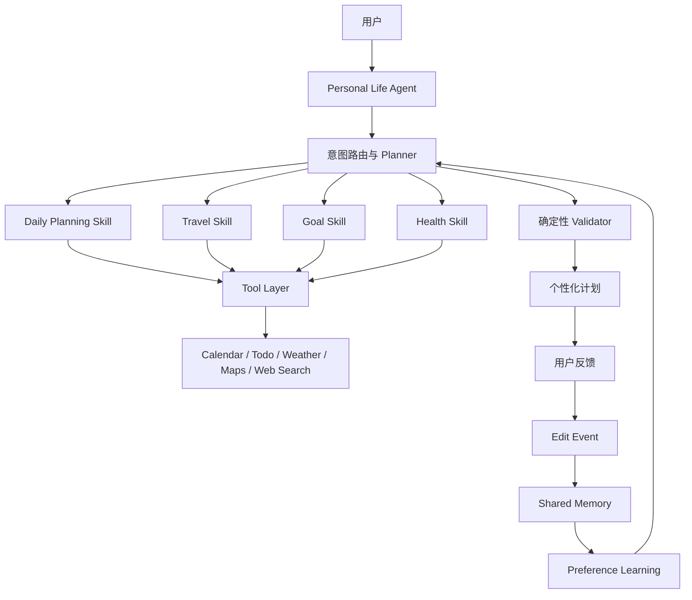
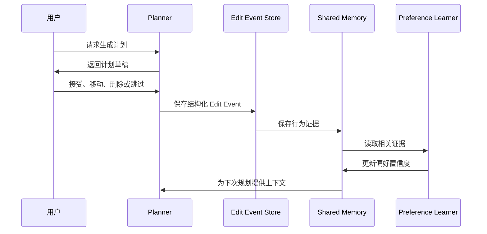

# Personal Life Agent

> **项目代号：Genshin-Agent**

[English](README.md) | [中文](README.zh-CN.md)

一个会逐步理解用户生活方式、并据此持续优化规划的个人 AI 助手。

> **Memory → Preference Learning → Personalized Planning**

## 项目状态

项目目前聚焦于 Daily Planner MVP：Planner、受控 Tool Layer、确定性的日程校验、Memory Models 和基础测试。当前最重要的目标是完成学习闭环，让用户对计划的修改能够影响下一次规划。

旅行、目标、健康及更多能力将作为 **Skill** 逐步接入，而不是独立的面向用户的 Agent。

## 项目愿景

大多数 AI 助手每次收到请求都从零开始。真正的个人助手应当具备连续性：它会记住相关上下文，观察用户如何调整计划，并通过反复使用变得更有帮助。

Personal Life Agent 为用户提供同一个一致的助手体验。日常规划、旅行、目标、健康和未来的其他领域能力，都以可组合的 Skill 形式接入，并能在合适的情况下使用对用户的共同理解。

## 核心理念

```text
用户需求 → 生成计划 → 用户反馈与修改 → Shared Memory
    ↑                                      ↓
    └──── Preference Learning ←────────────┘
```

系统从接受、移动、删除、跳过和编辑计划项等结构化证据中学习。单次修改不会被直接当成永久规则；系统会根据重复模式、上下文、时效性和置信度逐步聚合偏好。

## 系统架构



Planner 负责编排；Skill 解决明确的领域问题；Tool Layer 提供受控的外部数据和操作；Validator 执行硬约束；Shared Memory 则让上下文能够在不同 Skill 之间延续。

## 功能

### 当前 MVP

- 基于自然语言的日常规划
- Calendar、Todo、Weather 和 Preference 的工具抽象
- 结构化计划输出
- 确定性的时间冲突与规则校验
- Profile 与 Behavioral Memory 数据模型
- 面向用户修改的 Edit Event 记录
- Planner、Validator 与 Memory 的基础测试

### 计划中的 Skills

- **Travel：** 结合地图、天气、检索和偏好生成个性化行程
- **Goal：** 将长期目标拆解为可执行行动，并支持目标驱动规划
- **Health：** 在用户设定的边界内支持习惯与健康目标
- **更多 Skill：** Study、Finance、Shopping 等生活管理领域

## Memory System

| Memory 类型 | 用途 | 示例 |
| --- | --- | --- |
| Profile Memory | 用户明确给出的长期设置和事实 | 时区、工作时间、饮食限制 |
| Episodic Memory | 重要历史事件、计划和结果 | 最近一次旅行或错过的截止日期 |
| Behavioral Preference Memory | 从重复行为中聚合的证据 | 经常将健身改到 20:00 后 |
| Planning Context | 当前请求的短期上下文 | 今天已有日程和当前优先级 |

推断出的偏好应保存来源、置信度和更新时间；最终用户应能够查看、修正或删除这些偏好。

## Skills

Skill 是同一个 Agent 的能力扩展，而不是拥有彼此割裂 Memory 的独立产品。比如“偏好慢旅行”或“晚上运动”的信息，可以在合适的 Skill 中复用。

| Skill | 职责 | 状态 |
| --- | --- | --- |
| Daily Planning | 根据任务和约束生成可执行日计划 | MVP 重点 |
| Travel | 生成个性化旅行计划 | 计划中 |
| Goal | 连接长期目标与日常行动 | 计划中 |
| Health | 支持习惯与健康目标 | 计划中 |

## Tool Layer

| 类别 | 示例 | 职责 |
| --- | --- | --- |
| 个人组织 | Calendar、Todo | 读取已有安排；写入前必须确认 |
| 外部上下文 | Weather、Maps、Web Search | 为规划提供最新上下文 |
| 个性化 | Preference 与 Memory 检索 | 读取相关用户信息 |
| 安全 | Validator | 检查冲突与硬规则 |

Tool 以可替换接口设计。早期可使用 Mock Provider；接入真实服务时应最小化权限，并清晰展示所有会产生副作用的操作。

## Preference Learning



Planner 将学习到的偏好视为软信号。用户当前意图、已存在的日历安排和确定性硬约束始终优先。

## Roadmap

| 阶段 | 目标 | 状态 |
| --- | --- | --- |
| 1 | Daily Planner MVP：Planner、Tools、Validator、Memory Models、Tests | 进行中 |
| 2 | Edit Event → Memory Update → Preference Learning → 个性化规划 | 当前最高优先级 |
| 3 | 真实 Calendar、Todo、持久化存储与 Search 集成 | 计划中 |
| 4 | Goal Skill | 计划中 |
| 5 | Travel Skill | 计划中 |
| 6 | Reflection 与 Trajectory Learning | 计划中 |
| 7 | 面向复杂任务的内部 Multi-Agent 专业化协作 | 后续 |

Multi-Agent 是未来可选的内部实现升级；对用户而言，产品始终是一个 Personal Life Agent。

## 项目目录

```text
Genshin-Agent/
├── app/                    # 应用入口与界面
├── planner/                # 路由、规划与编排
├── skills/
│   ├── daily/
│   ├── travel/             # 计划中
│   ├── goal/               # 计划中
│   └── health/             # 计划中
├── memory/                 # 档案、事件与行为记忆
├── preference_learning/    # Edit Event 与偏好推断
├── tools/                  # 外部服务适配器
├── validator/              # 确定性校验
├── database/               # 存储与迁移
├── tests/
├── docs/
├── README.md
└── README.zh-CN.md
```

## 快速开始

> 具体命令会随实现最终确定。以下为计划中的 Python 本地开发流程。

```bash
git clone https://github.com/<your-org>/Genshin-Agent.git
cd Genshin-Agent
python -m venv .venv
source .venv/bin/activate
pip install -r requirements.txt
```

将仓库提供的环境变量示例复制为本地 `.env`，填写自己的凭据后，运行文档说明的应用或演示入口。不要提交 API Key、日历导出或用户 Memory 数据。

## 开发指南

- 将领域行为放在 Skill 中，将跨 Skill 协调放在 Planner 中。
- 在耦合具体厂商 API 前先定义 Tool 接口。
- 将用户反馈建模为结构化 Edit Event，而不是只保存自由文本日志。
- 每条学习到的偏好都保存来源、置信度和时效性。
- 用确定性逻辑校验时间冲突和硬约束。
- 修改规划、Memory、校验或学习逻辑时同步添加测试。

建议维护以下文档：

```text
docs/
├── architecture.md
├── roadmap.md
├── memory.md
├── preference-learning.md
├── skills.md
├── tools.md
├── development.md
├── api.md
└── demo.md
```

## 后续工作

- 让用户查看、修改、删除或关闭已学习的 Memory
- 建立计划质量、约束满足度与个性化程度的评估体系
- 制定长期数据的保留与隐私策略
- 安全同步日历和任务服务，并加入明确确认流程
- 完成交互式 Demo，展示“反馈 → 学习 → 下次更懂用户”的闭环
- 在复杂 Skill 内部接入检索、预订和优化等工作单元

## 贡献

欢迎贡献。请先在 Issue 或 Discussion 中说明用户问题、预期行为，以及涉及的 Skill 或平台模块。

提交 Pull Request 时请保持改动聚焦、补充测试、不提交凭据或真实用户数据，并说明对数据模型、权限或校验规则的修改。

## 许可证

项目计划采用 [MIT License](LICENSE)。公开发布前请加入 `LICENSE` 文件；在此之前，所有权利由项目维护者保留。
